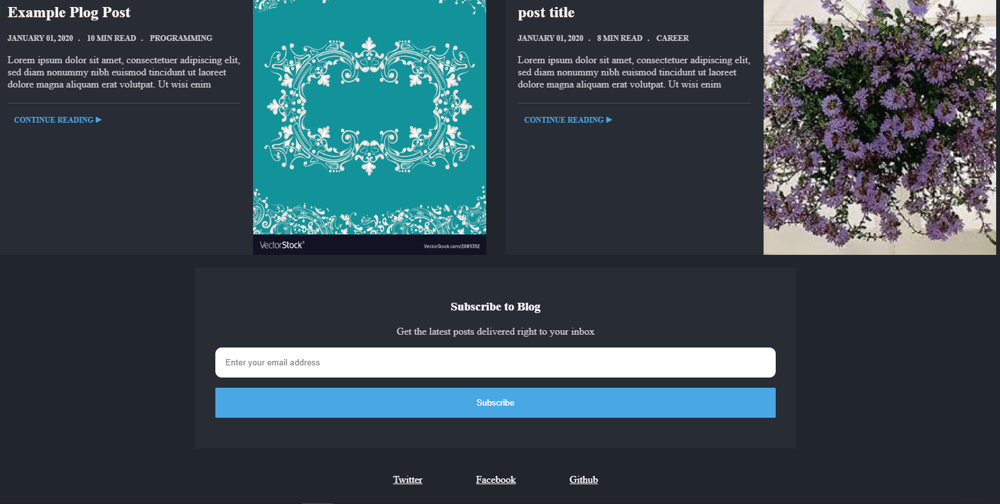

# Personal Blog Post
- This project is the first project of [Front end web developer Nanodegree](https://www.udacity.com/course/front-end-web-developer-nanodegree--nd0011) offered by [Udacity](https://www.udacity.com/).
- This project aims to create responsive web design using html and css.

## Tech stack
* HTML
* CSS


## ScreenShots of the app
- Home Page



## Main Files: Project Structure
```bash
├── home.html # contains structure of the home page
├── post.html # contains structure of the post page
├── README.md - This file.
├── css # contains all styles.
├── img # contains all images.
```
