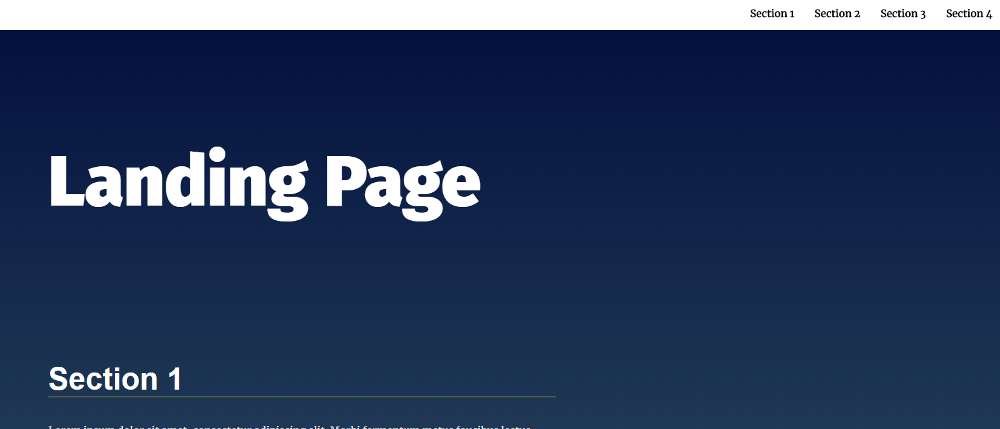
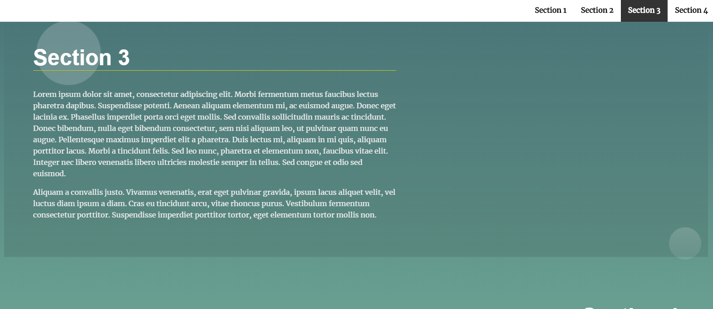

# Dynamic Landing Page
- This project is the project of JavaScript and the DOM course in [Front end web developer Nanodegree](https://www.udacity.com/course/front-end-web-developer-nanodegree--nd0011) offered by [Udacity](https://www.udacity.com/).
- This project aims to update and control a dynamic landing page and create a dynamic user experience.

## Tech stack
* HTML
* CSS
* Javascript(ES6)

## ScreenShots of the app



## Main Files: Project Structure
```bash
├── index.html # contains structure of the page
├── README.md - This file.
├── css
│   ├── styles.css # contains all styles.
└── js
    ├── app.css # contains functionality and interactivity of the page.
```

## Resources
* [How to Link to a Specific Part of a Page ](https://blog.hubspot.com/marketing/jump-link-same-page)
* [Access data attributes of an element](https://stackoverflow.com/questions/33760520/get-data-attributes-in-javascript-code)
* [Classlist attribute of Html element](https://developer.mozilla.org/en-US/docs/Web/API/Element/classList#Methods)
* [HTML data-* Attribute](https://www.w3schools.com/tags/att_data-.asp)
* [scroll-event](https://www.codeguage.com/courses/js/events-scroll-event)
* [Information regarding "Section active state"](https://knowledge.udacity.com/questions/85408#96950%20.)
* [How to highlight the nav link when scrolling to this section?](https://knowledge.udacity.com/questions/66312#66326)
